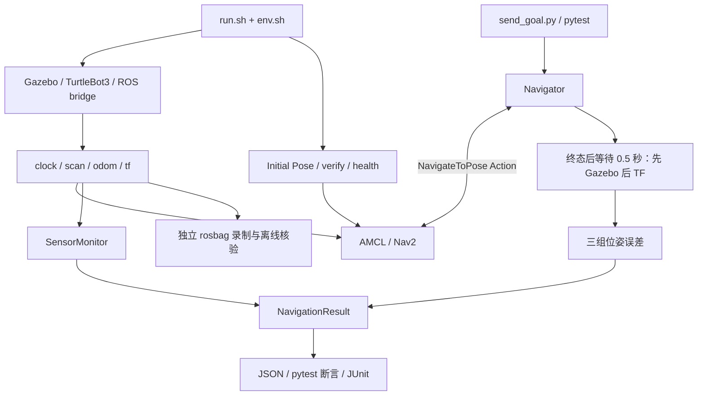

# ROS2 / Nav2 导航自动化测试

在 Gazebo 的 TurtleBot3 Burger 仿真中自动发送导航目标，采集 TF 估计位姿、Gazebo 真值和传感器消息，用 pytest 验收并保存 JSON、JUnit 与 rosbag 核验摘要。

项目重点是 **ROS2/Nav2 导航测试工程**：环境编排、Action 生命周期、观测采样、误差计算和证据留存。规划与控制由 Nav2 提供；项目经验范围为仿真测试。

源码基线沿用截至 **2026-09-28** 的本地版本，2026-09-29 整理公开文档与证据。下文导航、集成测试和 rosbag 数字均来自 **2026-09-22 历史记录**；9 月 27 日超时样本另列，不将历史结果当作本次重新执行。

## 技术栈

WSL2 / Ubuntu 24.04、ROS2 Jazzy、Nav2、Gazebo、TurtleBot3 Burger、Cyclone DDS、Python 3.12、rclpy、TF2、pytest、PyYAML、rosbag2 / MCAP。已保存 [2026-09-22 软件版本](results/public-20260922/package-versions.txt)。

当前启动链依赖已有 ROS 安装、用户级 systemd 服务和 WSLg 图形环境。默认地图路径位于 `/opt/ros/jazzy/share/turtlebot3_navigation2/map/map.yaml`。跨机器复现尚未验证。

## 架构与控制流



`Navigator` 分别等待服务器、目标应答和结果，使用单调墙钟限制等待时间。取消只针对本次目标 UUID；取消应答与最终 Action 状态分别记录。Action 成功、采样完整和误差达标是不同判断，详见 [导航模块说明](docs/工程化重构.md)。

## 运行方式

在已安装上述依赖的 Ubuntu 环境中，进入克隆后的仓库根目录。默认测试无需启动 Gazebo/Nav2，但 11 项 Mock/Fake 测试需要 ROS 消息类型：

```bash
source env.sh
python3 -m pytest -q
```

仅运行不依赖 ROS 的 25 项数学、配置和结果模型测试：

```bash
python3 -m pytest -q tests/test_metrics.py tests/test_navigation_result.py tests/test_config_ground_truth.py
```

启动仿真并保持终端打开，等待 `Baseline ready`：

```bash
bash run.sh
```

另开终端进入同一目录，再检查和导航。目标适用于默认地图、刚启动的出生位置；实际导航改变机器人位置，测试不会自动复位。

```bash
source env.sh
bash check.sh
python3 send_goal.py -1.3 -0.5 0
# yaw 单位为度；默认生成独立 JSON，--output 会覆盖指定文件。
bash stop.sh
```

`check.sh` 检查 lifecycle manager，`verify.py` 进一步检查数据链。CLI 退出 0 表示执行与采样完整，精度阈值由 pytest 判断。运行细节见 [环境操作说明](docs/环境操作说明.md)。

## 测试分层

以下为 **2026-09-22 历史结果**，不是 9 月 28/29 日新增集成实测。

| 逻辑层 | 用例数 | 范围 | 历史结果 |
|---|---:|---|---|
| 数学 / 配置 / 结果模型 | 25 | 位置与角度、配置校验、Gazebo 文本解析、JSON | 默认运行通过 |
| Mock/Fake ROS 客户端逻辑 | 11 | 成功/拒绝/中止、超时、迟到应答、取消和中断分支 | 默认运行通过 |
| 显式 integration | 4 | 独立 Action 通信、TF/Gazebo/传感器、缺失服务器、真实 Nav2 导航 | 默认跳过；历史分三次执行均通过 |

默认 JUnit 为 **40 collected / 36 passed / 4 skipped / 0 failed / 0 errors**。4 项 integration 已包含在 40 项中，不能与默认结果重复相加。Mock/Fake 与独立 Action Server 测试不等于真实 Nav2 故障注入。

## 代表性结果

[2026-09-22 导航 JSON](results/public-20260922/navigation.json)：目标 `(-1.3, -0.5, 0°)`，Action `SUCCEEDED`，`status=4`，`error_code=0`，`errors=[]`。

| 指标 | 距离误差（m） | yaw 误差（°） | 结论 |
|---|---:|---:|---|
| Goal → TF | 0.245974916 | 0.315771262 | 满足当前 integration 的 ≤0.25 m / ≤15° |
| TF → Gazebo | 0.016194790 | 0.537110971 | 记录观测值 |
| Goal → Gazebo | 0.256997356 | 0.852882233 | 记录观测值；不能声称真实到点距离 ≤0.25 m |

[2026-09-27 超时样本](results/public-20260927/server-timeout.json)：`server_timeout`，elapsed 约 11.455 s，无 Action 终态、TF/Gazebo 位姿，`metrics={}`，scan/odom 消息数为 0。只说明那次未连上 Action Server 且未收到这些消息，不能据此单独判断根因或项目回归失败。

## 证据说明

公开仓库保留少量 [JSON / JUnit / rosbag 摘要](results/README.md)。历史原始文件、恢复快照和运行日志仍留在本地；JUnit 公开副本移除了本机路径和主机名，测试结果与时间信息保留，见 [脱敏与来源说明](docs/公开证据说明.md)。

**rosbag 已完成录制和离线核验，原始 MCAP 不随本仓库上传。** [核验摘要](results/public-20260922/bag-validation.json)记录：8 topics、1770 条消息、9.296 s 仿真时间、odom 位移 0.457044554 m、61 条非零速度消息、最多 27 个路径点；`/tf_static` 采用 transient_local。未做 rosbag 自动回放验收。

## 已知限制

- Gazebo 与 TF 顺序采样，并非严格同步；world/map 对齐只针对当前 baseline。
- 0.5 s settle 不证明物理完全停稳；Action 成功也不等于真值精度通过。
- pytest yaw 阈值为 15°；Nav2 goal_checker 为 0.25 rad（约 14.32°），是两套配置。
- 长期稳定性、真实 Nav2 崩溃/丢包/SIGTERM/迟到响应/取消拒绝、动态障碍/碰撞、跨机器复现和 rosbag 自动回放验收均没有新增实测证据。
- 当前默认世界、地图、系统安装位置及 WSLg 设置属于运行前提；这里没有真实机器人验证结论。

## 目录结构

```text
robot_nav2_testing/
├── run.sh / env.sh / check.sh / stop.sh
├── sim.launch.py / nav.launch.py / *.baseline.yaml / baseline.rviz
├── send_goal.py
├── navigation/                 # 执行、采样、指标、配置与结果模型
├── config/                     # 测试阈值、rosbag QoS
├── tests/                      # 文件平铺，逻辑上分三层
├── docs/                       # 测试报告、运行与模块说明、公开证据说明
└── results/
    ├── public-20260922/         # 历史成功记录、JUnit、bag 摘要与来源哈希
    └── public-20260927/         # server_timeout 历史样本
```

本地的 `archive/`、`evidence/`、原始 `results/` 运行批次、日志、缓存、build/install/log 和原始 bag 由 `.gitignore` 排除。完整模块用途见 [文件说明](docs/文件说明.md)。

## 命令速查

在仓库根目录执行；ROS 相关命令先 `source env.sh`。新报告使用新路径，避免覆盖历史证据。

```bash
python3 -m pytest -q --junitxml=results/pytest-latest.xml
python3 -m pytest -q tests/test_action_transport.py --run-integration
# 以下需先启动 baseline；最后一项会移动机器人。
python3 -m pytest -q tests/test_integration.py --run-integration -k 'not test_navigation_result'
python3 -m pytest -q tests/test_integration.py --run-integration --navigation-goal -1.3 -0.5 0 -k test_navigation_result
python3 verify.py
bash stop.sh
```

## 本次发布检查（2026-09-29）

默认测试实际复跑为 **36 passed / 4 skipped**，见 [本次 JUnit](results/publication-20260929/pytest-default.xml)。仅此默认运行属于本次新增测试；没有重跑 integration、真实 Nav2 导航或 rosbag。已核对 Python/shell 语法、公开文档链接、历史证据哈希和脱敏副本一致性；源码与历史证据原件未改。
